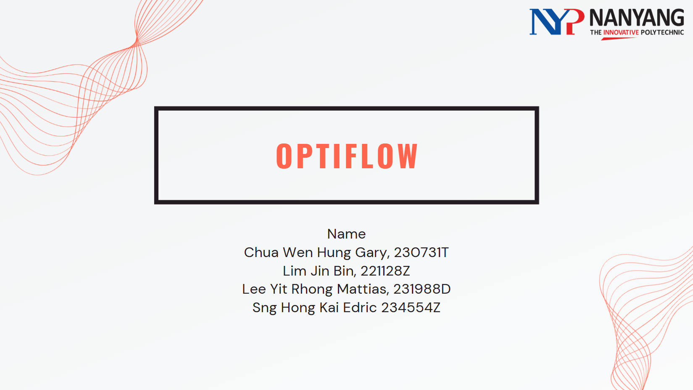
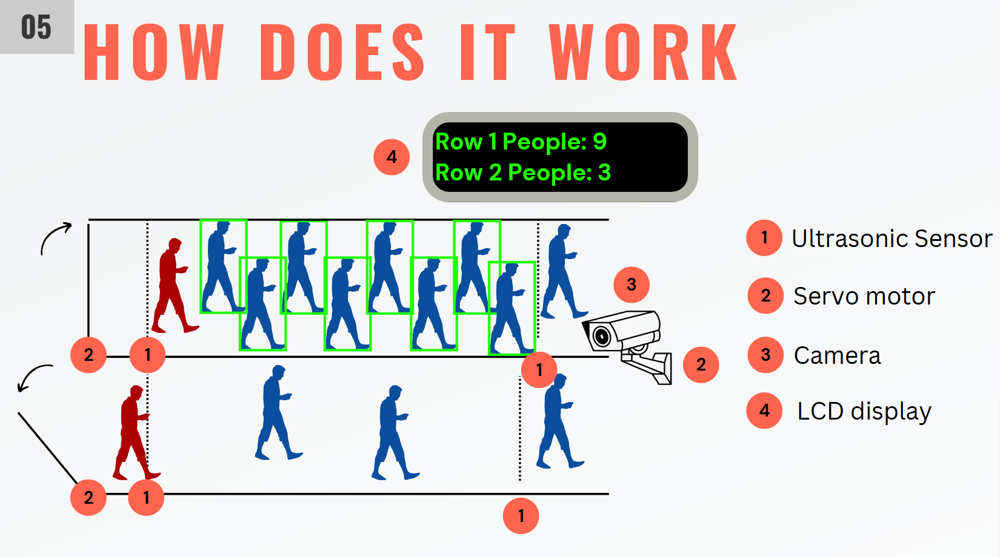
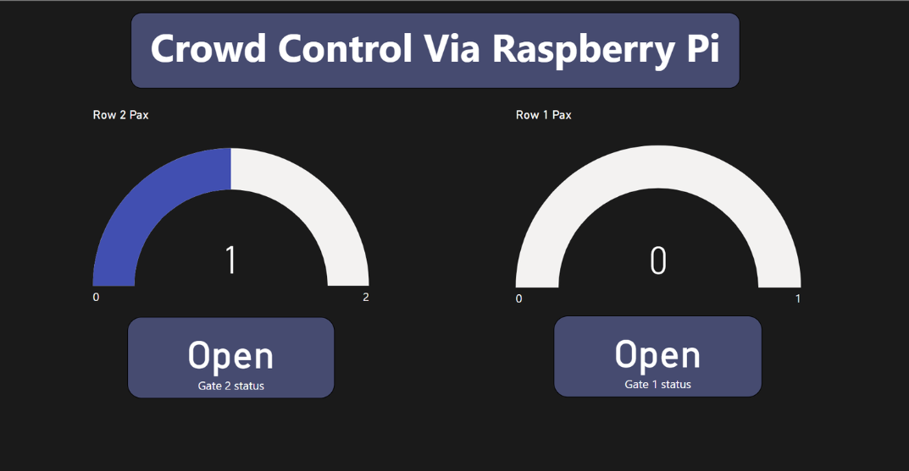

# Introduction

Optiflow is an AI-powered queue management system using a Raspberry Pi that combines sensors, computer vision, and automation to estimate crowd density across two queues in real time. The system uses a YOLOv8 object detection model to detect overcrowding early and automatically triggers actions (e.g., alerts/signage) to reduce congestion and improve flow in high foot traffic areas.

## 🚀 Features

- **Real-time dual-queue tracking**  
  Maintains live counts for two separate queues using entry/exit events.

- **Vision-based person verification (YOLOv8)**  
  Detects people from the PiCamera feed to validate counts and improve accuracy.

- **Overcrowding detection + automated response**  
  Triggers actions (e.g., alerts/signage / access control) when queue density exceeds a threshold.

- **Servo-controlled gate management**  
  Automatically manages access gates to regulate flow and prevent congestion.

- **Live status display (LCD)**  
  Shows real-time queue counts and system status for on-site monitoring.

- **Remote dashboard updates (Flask)**  
  Sends live queue metrics to a server endpoint for continuous dashboard updates and logging.

- **Snapshot capture with detection overlay**  
  Captures frames with bounding boxes for monitoring, debugging, and evidence.

- **Multi-threaded processing for stability**  
  Handles sensors, vision inference, display updates, and server requests concurrently for smooth real-time performance.

---

## ⚙️ Technologies & Components

- Raspberry Pi  
- Python  
- YOLOv8 (Ultralytics)  
- PiCamera2  
- gpiozero & RPi.GPIO  
- Grove LCD (JHD1802)  
- MySQL (for optional logging)  
- Flask (server-side logging)  
- OpenCV  

---

## 🔍 How It Works

1) **Detect entry/exit (Ultrasonic Sensors)**  
   Ultrasonic sensors placed at each queue detect when a person **enters or leaves**, updating the live count for **Queue 1** and **Queue 2**.

2) **Compute crowd density + display status (LCD)**  
   The Raspberry Pi continuously calculates **queue density** from the latest counts and displays:
   - Live people count per queue  
   - Queue status (Normal / Crowded)

3) **Regulate flow (Servo Motor Gates)**  
   When a queue exceeds a crowd threshold, the system triggers the servo motors to:
   - **Close** the gate to prevent overcrowding  
   - **Re-open** the gate once density returns to a safe level

4) **Verify & correct counts (Camera + YOLOv8 Override)**  
   A PiCamera runs **YOLOv8 person detection** to validate the sensor counts.  
   If the ultrasonic count is inaccurate (e.g., people walking too close together), YOLO **overrides/corrects** the count to maintain accuracy.

5) **Remote logging + live monitoring (Server + Dashboard)**  
   Queue metrics are sent to a **remote server** for logging, which then updates a **live dashboard** so staff can monitor queue conditions in real time.


**Pipeline summary:**  
`Ultrasonic Sensors → Live Count → Crowd Density → Servo Gate Control → YOLOv8 Override → Server Logging → Live Dashboard`

## 🎥 Video Demo

Watch Optiflow in action here:

- **Demo Video:** [https://youtu.be/RCbyLNdOA08]


## 📂 File Overview

- `smart_queue_control_system.py`: Main system script with all core functionality  
- `/snapshots`: Folder for storing captured and processed images - this folder is automcatically created when the script runs

---

## 📝 Notes

- Ensure all packages are installed and accessible on the Pi  
- Modify `SERVER_URL` to point to your Flask endpoint  
- Adjust pin assignments if your hardware differs  

---

# 📦 Required Packages

Install these packages on your Raspberry Pi environment:

```bash
pip install ultralytics
pip install opencv-python
pip install gpiozero
pip install RPi.GPIO
pip install smbus2
pip install mysql-connector-python
pip install requests
```
You may also need to manually install Grove display libraries and PiCamera2 support if not preloaded.

---

## 👤 Author & Credits

Optiflow was developed by:
- **Lim Jin Bin**
- [**Mattias Lee**](https://github.com/FatManSG)
- **Gary Lim**

**Programme:** Y2 AI & Data Engineering — Nanyang Polytechnic  
**Module:** IOTA (Internet of Things Application)

